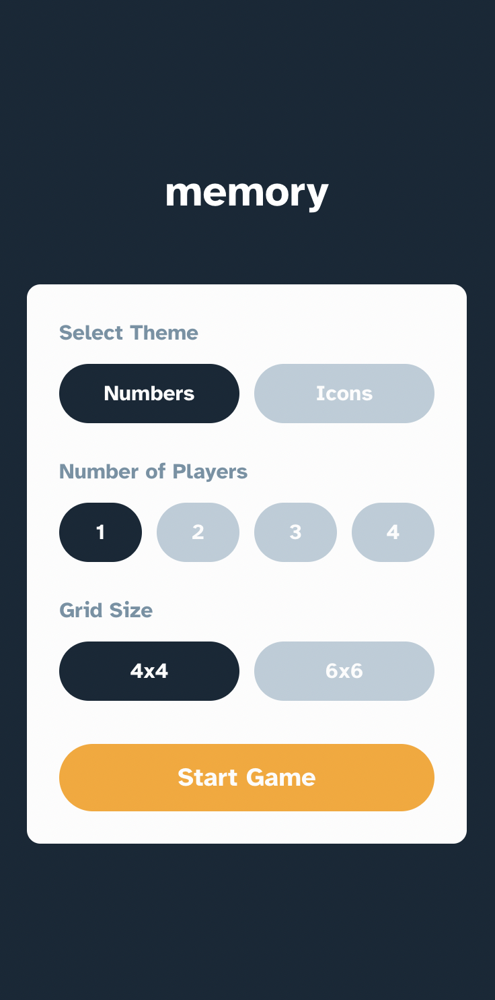
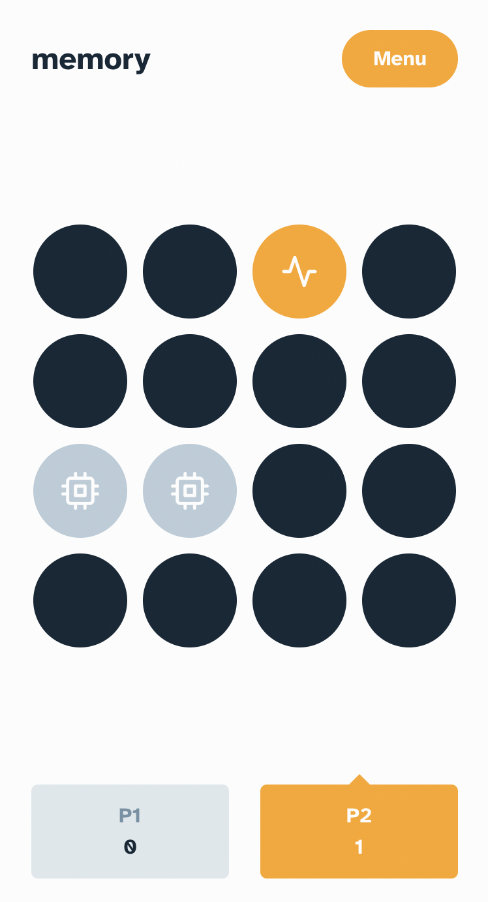

# Frontend Mentor - PhilDL Memory game solution

This is a solution to the [Memory game challenge on Frontend Mentor](https://www.frontendmentor.io/challenges/memory-game-vse4WFPvM). Frontend Mentor challenges help you improve your coding skills by building realistic projects. 

## Table of contents

- [Frontend Mentor - PhilDL Memory game solution](#frontend-mentor---phildl-memory-game-solution)
  - [Table of contents](#table-of-contents)
  - [Overview](#overview)
    - [The challenge](#the-challenge)
    - [Screenshot](#screenshot)
      - [Mobile Version](#mobile-version)
    - [Links](#links)
  - [My process](#my-process)
    - [Built with](#built-with)
    - [What I learned](#what-i-learned)
    - [Continued development](#continued-development)
  - [Author](#author)

**Note: Delete this note and update the table of contents based on what sections you keep.**

## Overview

### The challenge

Users should be able to:

- View the optimal layout for the game depending on their device's screen size
- See hover states for all interactive elements on the page
- Play the Memory game either solo or multiplayer (up to 4 players)
- Set the theme to use numbers or icons within the tiles
- Choose to play on either a 6x6 or 4x4 grid

### Screenshot

#### Mobile Version

### Links

- Solution URL: [https://github.com/PhilDL/memory-game](https://github.com/PhilDL/memory-game/)
- Live Site URL: [https://memory-game-phildl.vercel.app](https://memory-game-phildl.vercel.app/)

## My process

### Built with

- Semantic HTML5 markup
- CSS custom properties
- Flexbox
- CSS Grid
- Mobile-first workflow
- [React](https://reactjs.org/) - JS library
- [Styled Components](https://styled-components.com/) - For styles

**Note: These are just examples. Delete this note and replace the list above with your own choices**

### What I learned

Practicing CSS and React.

### Continued development

Need refactoring to handle game logic, maybe use Redux to train usage of library.

## Author

- Website - [PhilDL](https:/codingdodo.com)
- Frontend Mentor - [@PhilDL](https://www.frontendmentor.io/profile/PhilDL)
- Twitter - [@_philDL](https://www.twitter.com/_philDL)

